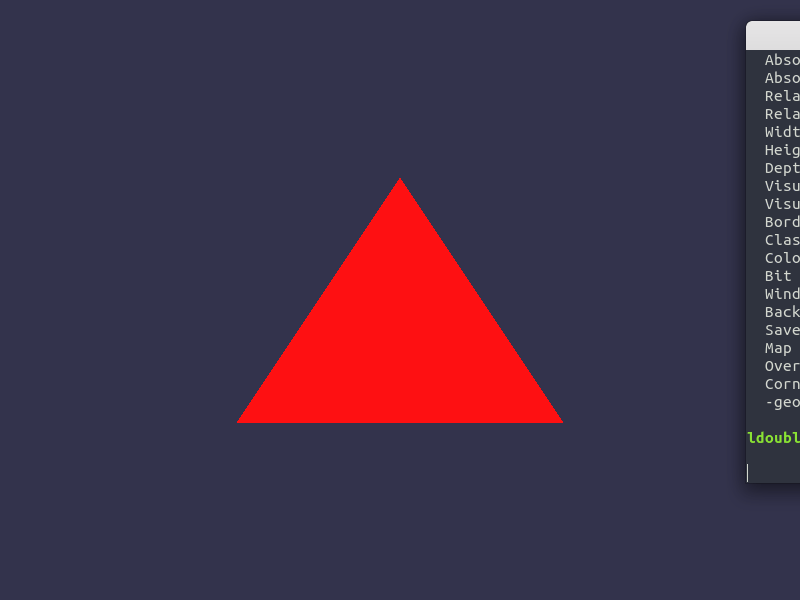

# Simple-OGL

使你能更方便的学习OpenGL。封装OpenGL常用缓冲区对象，简化OpenGL的使用。同时也提供了一些诸如模型加载，纹理加载，Camera对象等工具类。

## 使用需求
本项目使用了一些第三方库，在使用本项目前需要生成以下第三方库:

[GLFW](https://www.glfw.org/)  
[GLEW](http://glew.sourceforge.net/)  
[Assimp](http://assimp.sourceforge.net/lib_html/)  
[glm](https://github.com/g-truc/glm)

## 使用说明
待补充

## 展示
Shadow mapping:  

Colourful mipmap:  

